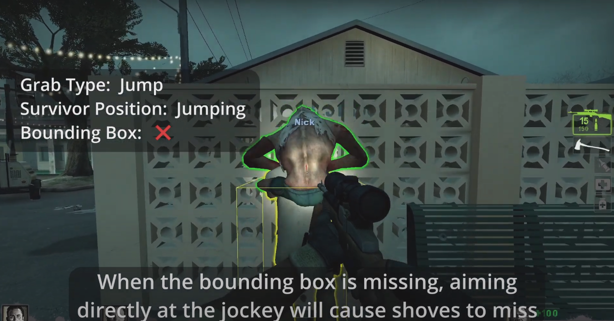
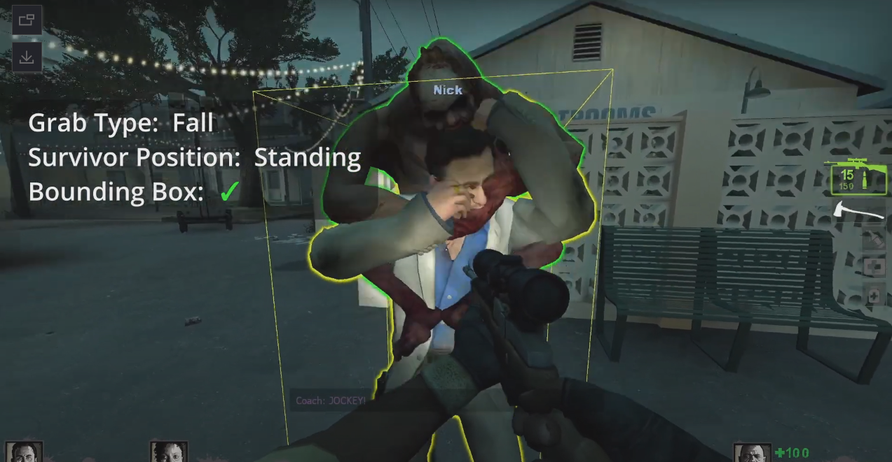

# Description | 內容
**📌原作 [Github](https://github.com/Target5150/MoYu_Server_Stupid_Plugins/tree/master/The%20Last%20Stand/l4d2_fix_jockey_hitbox "Github")**, 未任何修改

🔹修复骑师骑在幸存者身上时的碰撞问题, 仅限L4D2

---
* <details><summary>Video | 影片展示</summary>

	```感谢 **@Derpduck** 演示了这些错误的视频 [Youtube](https://www.youtube.com/watch?v=3DakbNJJzi8)```
</details>

* <details><summary>Image | 图示</summary>

	 
</details>

* Translation Support | 支持语言
<br>None

* <details><summary>Changelog | 版本日志</summary>

	*  (v2.0 2023/7/3 UTC+8) Jockey Hitbox: Fix unaligned hitboxes when riding

	* (v1.0 2022/10/16 UTC+8) Initial release.
</details>

* Require | 需求
<br>None

* Related Plugin | 相关插件
<br>None

* ConVar | 指令
<br>None

* Command | 命令
<br>None