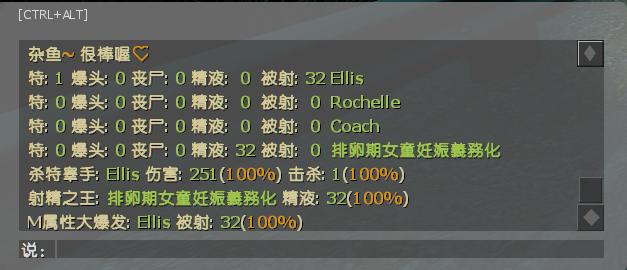
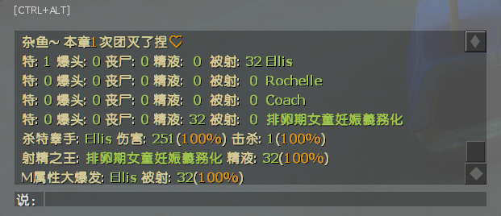
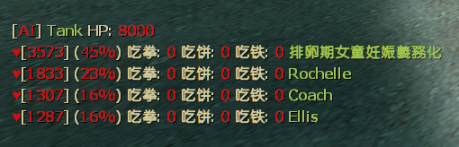

# Description | 內容
**📌幸存者MVP统计, 详情看图示**

<br>

> 修改了源码的一些文案

> 添加团灭次数统计

---
* Video | 影片展示
<br>None

* <details><summary>Image | 图示</summary>

	幸存者MVP统计:

	<br>
	
	<br>

	幸存者Tank MVP统计:

	
</details>

* <details><summary>Translation Support | 支持语言</summary>

	```
	简体中文
	```
</details>

* Changelog | 版本日志
<br>None

* Require | 需求
<br>None

* Related Plugin | 相关插件
<br>None

* <details><summary>ConVar | 指令</summary>

	* cfg/sourcemod/survivor_mvp.cfg
	```
	// 轮播时间间隔
	// Default: "240.0"
	// sm_mvp_time "240.0"
	```
</details>

* <details><summary>Command | 命令</summary>

	`sm_mvp`> 即时显示幸存者MVP统计信息
</details>