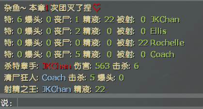

# 📌幸存者MVP统计

**原作 [GIthub](https://github.com/umlka/l4d2/blob/main/survivor_mvp/survivor_mvp.sp)**

**详情看图示**

> 修改源码的一些文案

> 修改源码添加团灭次数统计
---
<details><summary>Command | 指令</summary>

|指令|功能|权限|
|-|-|-|
|`!mvp`|即时显示幸存者MVP统计信息|Console|
</details>

Video | 影片展示
<br>None

<details><summary>Image | 图示</summary>

幸存者MVP统计:

<br>

<br>

幸存者Tank MVP统计:


</details>

<details><summary>ConVar | 控制台变量</summary>

cfg/sourcemod/survivor_mvp.cfg
```sourcepawn
// 轮播时间间隔
// Default: "240.0"
// sm_mvp_time "240.0"
```
</details>

<details><summary>Translation Support | 支持语言</summary>

```
简体中文
```
</details>

<details><summary>Apply to | 适用于</summary>

```php
L4D2
```
</details>

Require | 需求
<br>None

Related Plugin | 相关插件
<br>None

<details><summary>Changelog | 版本日志</summary>

- 2023.12.24
	- 修改规范插件名字
	- 添加团灭次数统计, `OnMapEnd()` 清空团灭计数
	- 分别在团灭次数0-20-50有不同的if判断, 从而输出不同语句
</details>