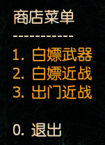
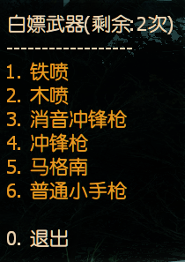
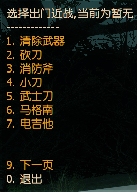

# 📌Shop点数商店(Lite 版本)

**原作 [Github](https://github.com/NanakaNeko/l4d2_plugins_coop/blob/main/scripting/shop_lite.sp "Github")**

Shop点数商店, 每关提供几次机会白嫖部分武器, cvar可自行设定每关几次

增加出门近战发放, 读取 steamid 写入 `data/melee.txt` 文件, 再次进服自动加载之前选择

> 修改源码的一些文案

> 修改RegConsoleCmd指令
---
<details><summary>Command | 指令</summary>

|指令|功能|权限|
|-|-|-|
|`!shop`|商店总开关|Admin|
|`!b` \ `!buy` \ `!rpg`|商店菜单|Console|
|`!ammo`|补充子弹, 有间隔时间控制|Console|
|`!chr`|快速选铁喷|Console|
|`!pum`|快速选木喷|Console|
|`!smg`|快速选smg|Console|
|`!uzi`|快速选uzi|Console|
</details>

Video | 影片展示
<br>None

<details><summary>Image | 图示</summary>

  
</details>

<details><summary>ConVar | 控制台变量</summary>

no cfg
```sourcepawn
//商店开关 开:0 关:1
l4d2_shop_disable 0

//每关单人白嫖上限
l4d2_weapon_number 2

//补充子弹的最小间隔时间,小于0.0关闭功能
l4d2_give_ammo_time 180
```
</details>

<details><summary>Translation Support | 支持语言</summary>

```
简体中文
```
</details>

Require | 需求
<br>None

<details><summary>Related Plugin | 相关插件</summary>

1. [shop](https://github.com/NanakaNeko/l4d2_plugins_coop/blob/main/scripting/shop.sp)
</details>

<details><summary>Changelog | 版本日志</summary>

- 2.1
	- 新增白嫖近战菜单

- 2.0
	- 新增管理员指令开关商店，!shop off关闭商店，!shop on打开商店，!shop查看当前商店开关情况
</details>