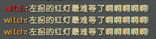

# 📌Witch惊扰提示

**原作 [GIthub](https://github.com/umlka/l4d2/blob/main/sms/sms.sp)**

> 从原作提取而出, 修改了源码的一些文案
> 增加随机惊扰文案
---
Command | 指令
<br>None

Video | 影片展示
<br>None

<details><summary>Image | 图示</summary>

❗必须要存在**特感bot**才会显示红色字体

<br>
</details>

<details><summary>ConVar | 控制台变量</summary>

no cfg
```sourcepawn
//Witch惊扰提示 1=开,0=关
sms_witchstartled_notify "1"
```
</details>

<details><summary>Translation Support | 支持语言</summary>

```
简体中文
```
</details>

<details><summary>Apply to | 适用于</summary>

```php
L4D2
```

Require | 需求
<br>None

Related Plugin | 相关插件
<br>None

Changelog | 版本日志
<br>None

<details><summary>Changelog | 版本日志</summary>

- 2024.02.11 > 更新随机文案提示, 详情看图示
</details>