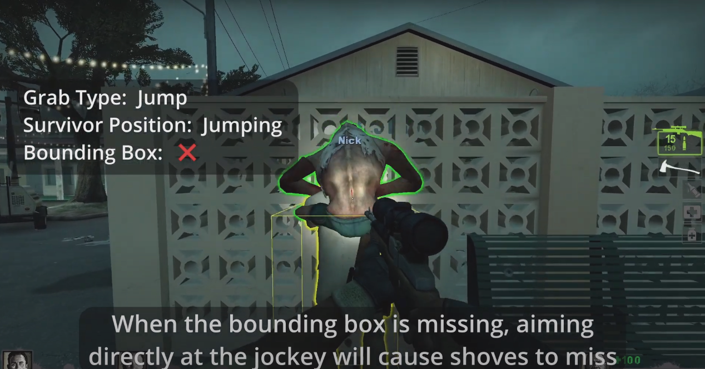
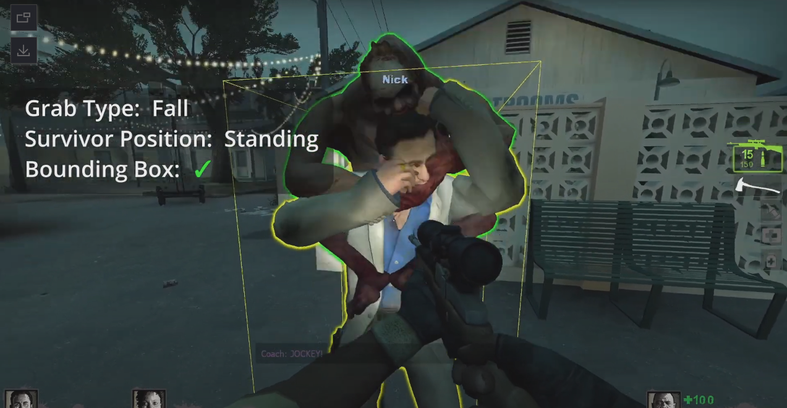

# 📌修复 Jockey 骑在幸存者身上时的碰撞问题

**原作 [Github](https://github.com/Target5150/MoYu_Server_Stupid_Plugins/tree/master/The%20Last%20Stand/l4d2_fix_jockey_hitbox)**, 未任何修改

---
Command | 指令
<br>None

<details><summary>Video | 影片展示</summary>

感谢 **@Derpduck*- 演示了这些错误的视频 [Youtube](https://www.youtube.com/watch?v=3DakbNJJzi8)
</details>

<details><summary>Image | 图示</summary>

 
</details>

 <details><summary>Apply to | 适用于</summary>

```
L4D2 only
```
</details>

ConVar | 控制台变量
<br>None

Translation Support | 支持语言
<br>None

Require | 需求
<br>None

Related Plugin | 相关插件
<br>None

<details><summary>Changelog | 版本日志</summary>

-  (v2.0 2023/7/3 UTC+8) Jockey Hitbox: Fix unaligned hitboxes when riding

-  (v1.0 2022/10/16 UTC+8) Initial release.
</details>