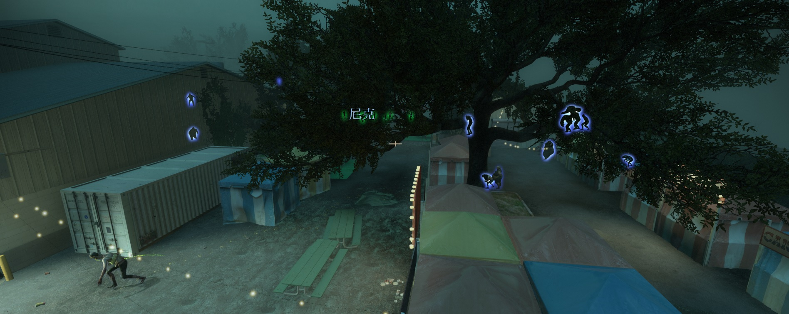
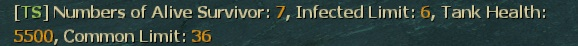
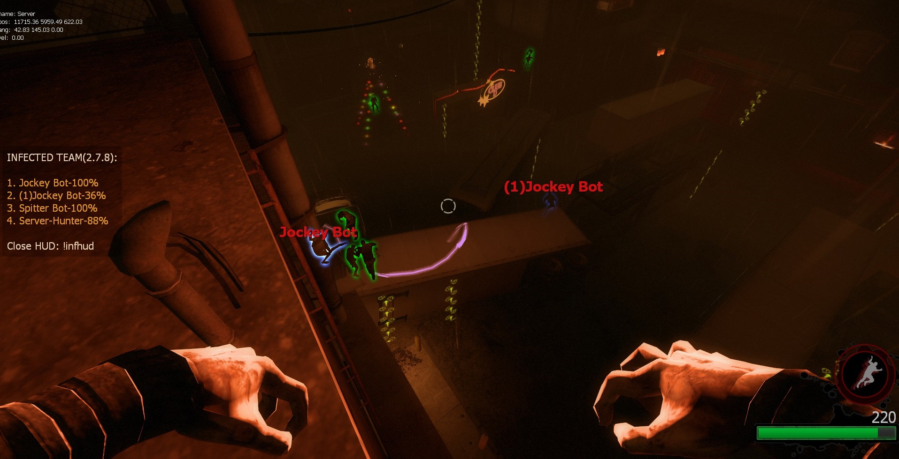

# 📌多特感生成

原作 [Github](https://github.com/fbef0102/L4D1_2-Plugins/tree/master/l4dinfectedbots)

> 删除了 `!zs` 指令, 防止和其它插件指令冲突

> 修改源码的提示文案

<details><summary>简介</summary>

- 此插件控制游戏导演生成系统, 能够强制无视游戏特感数量限制, 生成多特感
- 当幸存者变多时, 僵尸数量变多、特感数量变多、Tank数量变多、Tank血量变多, 提升游戏难度
- 此插件可以让玩家在战役/写实/生存模式下加入特感阵营, 用来恶搞战役玩家XD
- 解锁特感队伍的人数上限, 可以加入第五位以上的特感真人玩家, 达成对抗 10 VS 10 玩法
- **支持所有模式包括突变模式**
</details>

---
<details><summary>Command | 指令</summary>

|指令|功能|权限|
|-|-|-|
|`!ji`|(仅限战役/写实/幸存者) 加入到感染者阵营|Admin & Console, 有cvar控制权限|
|`!js`|(仅限战役/写实/幸存者) 加入到幸存者阵营|Admin & Console, 有cvar控制权限|
|`!infhud`|开关感染者HUD, 只有开启转换阵容cvar才有实际效果<br>`l4d_infectedbots_coop_versus "1"`|Console|
|`!timer`|设置特感的生成时间 (权限: ADMFLAG_SLAY)|Admin|
|`!zlimit`|设置场上特感的数量上限 (权限: ADMFLAG_SLAY)|Admin|
|~~`!zs`~~|已删除指令, 防止和其它插件指令冲突<br>~~(仅限感染者玩家) 感染者玩家自杀 (让感染者卡住时可以死亡)~~||
</details>

Video | 影片展示
<br>None

<details><summary>Image | 图示</summary>

<br>


- Join infected team and play in coop/survival/realism mode.

	- 在战役/写实/生存模式下加入特感阵营<br>
	
</details>

<details><summary>ConVar | 控制台变量</summary>

<br>

此内容为自用 cvar, 仅当刷特插件, 并固定多少特多少秒刷特

关闭了: 转换阵容, 小僵尸数量\Tank数量和血量, witch数量

- <details><summary>部分Cvar参数解释</summary>

	<br>

	<details><summary>设置特感生成最大数量限制</summary>

	```sourcepawn
	l4d_infectedbots_charger_limit
	l4d_infectedbots_boomer_limit 
	l4d_infectedbots_hunter_limit
	l4d_infectedbots_jockey_limit
	l4d_infectedbots_smoker_limit
	l4d_infectedbots_spitter_limit
	```

	- 这6个cvar值加在一起必须等于或超过 `l4d_infectedbots_max_specials` <br>For example:

	```sourcepawn
	// 好的
	l4d_infectedbots_charger_limit 1
	l4d_infectedbots_boomer_limit 1
	l4d_infectedbots_hunter_limit 1
	l4d_infectedbots_jockey_limit 1
	l4d_infectedbots_smoker_limit 1
	l4d_infectedbots_spitter_limit 1
	l4d_infectedbots_max_specials 6 
	```

	```sourcepawn
	// 好的
	l4d_infectedbots_charger_limit 1
	l4d_infectedbots_boomer_limit 2
	l4d_infectedbots_hunter_limit 4
	l4d_infectedbots_jockey_limit 2
	l4d_infectedbots_smoker_limit 2
	l4d_infectedbots_spitter_limit 2
	l4d_infectedbots_max_specials 10 
	```

	```sourcepawn
	// 烂, 没设置好
	l4d_infectedbots_charger_limit 0
	l4d_infectedbots_boomer_limit 1
	l4d_infectedbots_hunter_limit 2
	l4d_infectedbots_jockey_limit 0
	l4d_infectedbots_smoker_limit 1
	l4d_infectedbots_spitter_limit 0
	l4d_infectedbots_max_specials 9 
	```

	> __Note__ 
	<br/>1. 请注意, 最大数量限制不包含witch的数量, 但会包含Tank的数量
	<br/>2. 在对抗／清道夫模式中, 特感最大生成数量 = 特感队伍的空位
	</details>

	<details><summary>5位以上存活的幸存者调整特感最大生成数量</summary>

	- 例如: 如果第5位以上存活的幸存者, 每3个玩家加入, 最大的特感数量加2<br>因此, 如果有10个存活的幸存者, 则特感最大生成数量为:4+2+2=8
		```php
		l4d_infectedbots_max_specials "4"
		l4d_infectedbots_add_specials "2"
		l4d_infectedbots_add_specials_scale "3"
		```

	- 如果不想改变特感生成数量, 可以设置
		```php
		l4d_infectedbots_add_specials "0"
		```

	> __Note__ 
	<br/>在对抗／清道夫模式中, 特感最大生成数量 = 特感队伍的空位
	</details>

	<details><summary>在战役/幸存者/写实模式下成为感染者</summary>

	- 例如:只有拥有 "z "权限的玩家才能加入感染者阵营, 且感染者只能有2个名额

	```sourcepawn
	l4d_infectedbots_coop_versus "1"
	l4d_infectedbots_coop_versus_join_access "z"
	l4d_infectedbots_coop_versus_human_limit "2"
	```

	- 如果想所有玩家可以加入感染者阵营, 请设置

	```sourcepawn
	l4d_infectedbots_coop_versus_join_access ""
	```

	- 在战役/幸存者/写实中, 感染者玩家将以灵魂状态下复活

	```sourcepawn
	l4d_infectedbots_coop_versus_human_ghost_enable "1" 
	```	

	- 感染者玩家可以接管在场上的Tank:

	```sourcepawn
	l4d_infectedbots_coop_versus_Tank_playable "1" 
	```
	</details>

	<details><summary>如何生成Tank</summary>

	- 每次生成特感都有5%的几率生成Tank<br>请注意, 如果达到了Tank数量上限或生成Tank的概率为0%, 仍然不会产生Tank (不影响游戏生成的Tank)

	```sourcepawn
	l4d_infectedbots_Tank_limit "2"
	l4d_infectedbots_Tank_spawn_probability "5"
	```

	- 如果想在最后救援时不生成Tank(不影响游戏生成的Tank), 请设置

	```sourcepawn
	l4d_infectedbots_Tank_spawn_final "0"
	```
	</details>

	<details><summary>5位以上存活的幸存者调整Tank生成限制</summary>

	- Tank上限 = 场上同时存在Tank的数量

	- 这意味着如果有第5位以上存活的幸存者, 每5个玩家加入, Tank可生成上限数量加1<br>因此, 如果有10个存活的幸存者, Tank可生成上限数量为: 2+1=3 (不影响游戏生成的Tank)

	```sourcepawn
	l4d_infectedbots_Tank_limit "2"
	l4d_infectedbots_add_Tanklimit "1"
	l4d_infectedbots_add_Tanklimit_scale "5"
	```

	- 如果想关闭这个功能, 请设置 

	```sourcepawn
	l4d_infectedbots_add_Tanklimit "0"
	```
	</details>

	<details><summary>5位以上存活的幸存者调整Tank血量</summary>

	- 例如: 有第5位以上存活的幸存者, 每3个玩家加入, Tank的血量就会增加1200<br/>因此, 如果有10个存活的幸存者, Tank血量为:4000+1200+1200=6400hp

	```sourcepawn
	l4d_infectedbots_adjust_Tankhealth_enable "1"
	l4d_infectedbots_default_Tankhealth "4000"
	l4d_infectedbots_add_Tankhealth "1200"
	l4d_infectedbots_add_Tankhealth_scale "3"
	```

	- 如果想关闭这个功能, 不想让这个插件改变Tank血量, 请设置

	```sourcepawn
	l4d_infectedbots_adjust_Tankhealth_enable "0"
	```
	>__Note__
	<br>Tank血量会依照游戏模式与难度自动做出最终调整, 譬如设置Tank血量为4000, 则
	<br>简单难度下Tank血量最终为 4000 - 0.75 = 3000
	<br>一般难度下Tank血量最终为 4000 - 1.0 = 4000
	<br>进阶/专家难度下Tank血量最终为 4000 - 2.0 = 8000
	<br>对抗/清道夫模式下Tank血量最终为 4000 - 1.5 = 6000
	</details>

	<details><summary>5位以上存活的幸存者调整普通僵尸最大数量</summary>

	- 例如:有第5位以上存活的幸存者, 每一个玩家加入, 普通僵尸最大数量将会增加2个<br>因此, 如果有10个存活的幸存者, 普通僵尸数量为: 30+2+2+2+2+2+2 = 42

	```sourcepawn
	l4d_infectedbots_adjust_commonlimit_enable "1"
	l4d_infectedbots_default_commonlimit "30"
	l4d_infectedbots_add_commonlimit_scale "1"
	l4d_infectedbots_add_commonlimit "2"
	```

	- 如果想关闭这个功能, 不想让这个插件改变僵尸最大数量, 请设置

	```sourcepawn
	l4d_infectedbots_adjust_commonlimit_enable "0"
	```
	</details>

	<details><summary>调整特感生成时间</summary>

	- 根据每个存活的幸存者, 减少一定数值的特感生成时间<br>如果有5个存活的幸存者, 则特感生成时间为:[最长时间: 60-(5x2) = 50, 最短时间: 30-(5x2) = 20]

	```sourcepawn
	l4d_infectedbots_spawn_time_max "60"
	l4d_infectedbots_spawn_time_min "30"
	l4d_infectedbots_adjust_spawn_times "1"
	l4d_infectedbots_adjust_reduced_spawn_times_on_player "2"
	```

	- 如果想关闭这个功能, 请设置 

	```sourcepawn
	l4d_infectedbots_adjust_spawn_times "0"
	```

	- (对抗/清道夫) 如何控制真人特感玩家的复活时间?
		- 真人玩家的复活时间是根据官方指令设定

		```sourcepawn
		sm_cvar z_ghost_delay_min "20"
		sm_cvar z_ghost_delay_max "30"
		```

		- 也依照"特感玩家数量"与"特感队伍空位"自动做出最终调整, 其公式为

		```sourcepawn
		// 如果"特感玩家数量" 大于等于4, 则以4代入计算
		// 如果"特感队伍空位" 大于等于4, 则以4代入计算
		最短时间: z_ghost_delay_min - (特感玩家数量 ÷ 特感队伍空位) 
		最长时间: z_ghost_delay_max - (特感玩家数量 ÷ 特感队伍空位)
		```

		- 以下举例

		```sourcepawn
		// 特感玩家:3人, 特感队伍空位:4人, z_ghost_delay_min: 30, z_ghost_delay_max: 40
		特感玩家复活时间最终为: [最短时间: 30 - (3÷4) = 22.5秒, 最长时间: 40 - (3÷4) = 30秒]

		// 特感玩家:1人, 特感队伍空位:1人, z_ghost_delay_min: 3, z_ghost_delay_max: 3
		特感玩家复活时间最终为: 3 - (1÷1) = 3秒

		// 特感玩家:2人, 特感队伍空位:4人, z_ghost_delay_min: 18, z_ghost_delay_max: 18
		特感玩家复活时间最终为: 18 - (2÷4) = 9秒

		// 特感玩家:3人, 特感队伍空位:8人, z_ghost_delay_min: 20, z_ghost_delay_max: 20
		特感玩家复活时间最终为: 20 - (3÷4) = 15秒

		// 特感玩家:4人, 特感队伍空位:8人, z_ghost_delay_min: 20, z_ghost_delay_max: 20
		特感玩家复活时间最终为: 20 - (4÷4) = 20秒

		// 特感玩家:7人, 特感队伍空位:8人, z_ghost_delay_min: 20, z_ghost_delay_max: 20
		特感玩家复活时间最终为: 20 - (4÷4) = 20秒
		```
	</details>

	<details><summary>特感生成距离 (仅限战役/写实)</summary>

	- 请注意!这个指令也会影响普通僵尸的生成范围

	```sourcepawn
	l4d_infectedbots_spawn_range_min "350"
	```

	- 让特感可以在非常接近幸存者的地方复活, 以获得更好的游戏体验

	```sourcepawn
	l4d_infectedbots_spawn_range_min "0" 
	```

	> __Warning__ 
	<br/>在对抗/清道夫模式中, 这个指令会影响灵魂状态下真人特感玩家的复活范围
	</details>

	<details><summary>刷特模式</summary>

	- 如果为1, 则感染者需要等待其他感染者准备好才能一起被插件生成攻击幸存者<br>如果为0, 相当于特感速递模式, 场上特感总数 为 `l4d_infectedbots_max_specials`

	```sourcepawn
	l4d_infectedbots_coordination "1" 
	```

	- 当场上有存活的Tank时停止生成AI特感

	```sourcepawn
	l4d_infectedbots_spawns_disabled_Tank "1" 
	```
	</details>

	<details><summary>设置刷特权重</summary>

	- 除了Tank与Witch以外可以增减特感的权重, 譬如

	```sourcepawn
	// 每一次特感生成, 有很大的机率生成Hunter与Charger
	// 如果Hunter与Charger达到最大数量限制, 则根据权重分配生成其他特感
	l4d_infectedbots_boomer_weight "5"
	l4d_infectedbots_charger_weight "90"
	l4d_infectedbots_hunter_weight "100"
	l4d_infectedbots_jockey_weight "10"
	l4d_infectedbots_smoker_weight "5"
	l4d_infectedbots_spitter_weight "8"
	```

	- 可根据"场上特感数量"与"生成最大数量"两种值调整每个特感的权重 (公式如何计算, 不要问)

	```sourcepawn
	// 如果为1, 可生成的最大数量越多, 该特感的权重值越高
	// 如果为1, 场上相同特感种类的数量越多, 该特感的权重值越低
	l4d_infectedbots_scale_weights "1"
	```
	</details>

	<details><summary>关闭插件提示</summary>

	

	- 当存活的幸存者数量发生变化时宣布插件状态, 0=关 1=开

	```sourcepawn
	l4d_infectedbots_announcement_enable "0" 
	```
	</details>

	<details><summary>关闭感染者玩家发出红色的光</summary>

	

	- 0=关 1=开

	```sourcepawn
	l4d_infectedbots_coop_versus_human_light "0" 
	```
	</details>

	<details><summary>停止特感Bots生成</summary>

	- 在对抗/清道夫模式中, 关闭特感bots生成, 只允许真人特感玩家生成特感 (此插件会继续生成Witch、不影响导演系统)

	```sourcepawn
	l4d_infectedbots_disable_infected_bots "1"
	```
	</details>

	<details><summary>计算第5位以上死亡的幸存者</summary>

	- 调整特感最大生成数量、Tank血量、普通僵尸最大数量、Tank生成限制时, 计算幸存者数量时也包含死亡的玩家

	```sourcepawn
	l4d_infectedbots_calculate_including_dead_player "1"
	```
	</details>

cfg/sourcemod/l4dinfectedbots.cfg
```sourcepawn
// This file was auto-generated by SourceMod (v1.11.0.6926)
// ConVars for plugin "l4dinfectedbots.smx"

// 在对抗/清道夫模式中, 关闭特感bots生成, 只允许真人特感玩家生成特感 (此插件会继续生成Witch, 不影响导演系统)
l4d_infectedbots_disable_infected_bots "0"

// --- 动态小僵尸参数 ---
// 如果为1, 则启用根据存活的幸存者数量调整僵尸数量
l4d_infectedbots_adjust_commonlimit_enable "0"

// 当幸存者数量不超过5人的僵尸数量
l4d_infectedbots_default_commonlimit "8"

// 存活的幸存者数量超过4个时, 最大普通僵尸数量上限 = default_commonlimit + [(存活的幸存者数量-4) ÷ 'add_commonlimit_scale'] × 'add_commonlimit'
l4d_infectedbots_add_commonlimit_scale "1"
 
// 存活的幸存者数量超过4个时, 每加入一个'l4d_infectedbots_default_commonlimit'的玩家, 就增加一定的值到'l4d_infectedbots_add_commonlimit_scale'
l4d_infectedbots_add_commonlimit "4"

// --- 动态特感参数 ---
// 幸存者少于4个及以下可生成的最大特感数量(必须让7个特感数量{不包括witch}上限的值加起来超过这个值
l4d_infectedbots_max_specials "18"

// 存活的幸存者数量超过4个时, 最大特感数量上限 = max_specials + [(存活的幸存者数量-4) ÷ 'add_specials_scale'] × 'add_specials'
// 每增加n位幸存者
l4d_infectedbots_add_specials_scale "0"

// 存活的幸存者数量超过4个时, 每加入一个'l4d_infectedbots_max_specials'的玩家, 就增加一定的值到'l4d_infectedbots_add_specials_scale'
// 每增加n位幸存者则+N特感数值,0=关闭
l4d_infectedbots_add_specials "2"

//--- 特感时间\生成参数 ---
// 在地图第一关离开安全区后多长时间开始刷特
l4d_infectedbots_initial_spawn_timer "40"

// 如果为1, 即使幸存者尚未离开安全区域, 游戏依然能生成特感
l4d_infectedbots_safe_spawn "0"
 
// 如果为1, 则根据幸存者数量与特感队伍的真人玩家数量调整特感复活时间
l4d_infectedbots_adjust_spawn_times "0"
 
// 每增加一位幸存者, 则减少(存活的幸存者数量-l4d_infectedbots_adjust_reduced_spawn_times_on_player)复活时间(初始4位幸存者也算在内)
l4d_infectedbots_adjust_reduced_spawn_times_on_player "1"
 
// 允许特感在同一个时间点复活没有误差 (小心启动, 会影响服务器卡顿)
l4d_infectedbots_spawn_on_same_frame 0// 从哪里寻找位置复活特感? (0=最前方幸存者附近, 1=随机的幸存者附近)
l4d_infectedbots_spawn_where_method "1"

// 特感生成的最小距离 (默认: 550, 仅战役/写实)
// 这个cvar也会影响普通僵尸的生成范围和灵魂状态下感染者玩家的复活距离
l4d_infectedbots_spawn_range_min "350"

// 设置插件生成的特感最大时间(秒)
l4d_infectedbots_spawn_time_max "20"

// 设置插件生成的特感最小时间(秒)
l4d_infectedbots_spawn_time_min "20"

// AI特感生成多少秒后踢出(AI防卡)
l4d_infectedbots_lifespan "25"

// 调整特感最大生成数量, Tank血量, 普通僵尸最大数量, tank生成限制时, 计算倖存者数量时也包含死亡的玩家
l4d_infectedbots_calculate_including_dead_player "0"

// 如果为1, 则当Tank存活时禁止特感复活
l4d_infectedbots_spawns_disabled_tank "1"

// --- 动态tank血量 ---
// 存活的幸存者数量超过4个时, 每加入一个'l4d_infectedbots_default_tankhealth'的玩家, 就增加一定的数值到'l4d_infectedbots_add_tankhealth_scale'
l4d_infectedbots_add_tankhealth "100"

// 存活的幸存者数量超过4个时, Tank血量上限 = max_specials + [(存活的幸存者数量-4) ÷ 'add_specials_scale'] × 'add_specials']
l4d_infectedbots_add_tankhealth_scale "1"

// 存活的幸存者数量超过4个时, 每加入一个'l4d_infectedbots_tank_limit'的玩家, 就增加一定的值给'l4d_infectedbots_add_tanklimit_scale'
l4d_infectedbots_add_tanklimit "1"

// 存活的幸存者数量超过4个时, Tank数量上限 = tank_limit + [(存活的幸存者数量-4) ÷ 'add_tanklimit_scale'] × 'add_tanklimit'
l4d_infectedbots_add_tanklimit_scale "3"

// 设置Tank默认血量上限, Tank血量上限受到游戏难度或模式影响 (若Tank血量上限设置为4000, 则简单难度3000血, 普通难度4000血, 对抗类型模式6000血, 高级/专家难度血量8000血)
l4d_infectedbots_default_tankhealth "4000"

// 如果为1, 则根据幸存者数量修改Tank血量上限
l4d_infectedbots_adjust_tankhealth_enable "0"

// 0=关闭插件, 1=开启插件
l4d_infectedbots_allow "1"

// 如果为1, 则当存活的幸存者数量发生变化时宣布插件状态
l4d_infectedbots_announcement_enable "0"

// 在战役/幸存者/清道夫中设置通过插件加入到感染者的玩家数量
l4d_infectedbots_coop_versus_human_limit "2"

// 有什么权限的玩家在战役/写实/生存模式中可以加入到感染者 (无内容 = 所有人, -1: 无法加入)
l4d_infectedbots_coop_versus_join_access "-1"

// 如果为1, 玩家可以在战役/写实/生存模式中接管Tank
l4d_infectedbots_coop_versus_tank_playable "1"

// 如果为1, 则玩家可以在战役/写实/生存模式中加入感染者(!ji加入感染者 !js加入幸存者)"
l4d_infectedbots_coop_versus "1"

// 如果为1, 则通知玩家如何加入到幸存者和感染者
l4d_infectedbots_coop_versus_announce "0"

// 如果为1, 则在战役/写实/生存模式中, 感染者玩家将以灵魂状态复活
l4d_infectedbots_coop_versus_human_ghost_enable "1"

// 如果为1, 则感染者玩家将发出红色的光
l4d_infectedbots_coop_versus_human_light "1"

// 是否提示感染者玩家如何开启HUD
l4d_infectedbots_infhud_announce "1"

// 感染者玩家是否开启HUD
l4d_infectedbots_infhud_enable "1"

// 如果为1, 则感染者需要等待其他感染者准备好才能一起被插件生成攻击幸存者
// 如果为0, 则感染者先场上复活5个 死了一个就会有灵魂状态的感染者顶替复活 轮流上场 保持在场能有3-5个特感, 变成特感速递
l4d_infectedbots_coordination "1"

// --- 单个特感生成数量 ---
// 插件可生成boomer的最大数量
l4d_infectedbots_boomer_limit "3"

// 插件生成boomer的权重值 [0~100]
l4d_infectedbots_boomer_weight "90"

// 插件可生成charger的最大数量
l4d_infectedbots_charger_limit "5"

// 插件生成charger的权重值 [0~100]
l4d_infectedbots_charger_weight "100"

// 插件可生成hunter的最大数量
l4d_infectedbots_hunter_limit "5"

// 插件生成hunter的权重值 [0~100]
l4d_infectedbots_hunter_weight "100"

// 插件可生成jockey的最大数量
l4d_infectedbots_jockey_limit "5"

// 插件生成jockey的权重值 [0~100]
l4d_infectedbots_jockey_weight "100"

// 插件可生成smoker的最大数量
l4d_infectedbots_smoker_limit "4"

// 插件生成smoker的权重值 [0~100]
l4d_infectedbots_smoker_weight "90"

// 插件可生成spitter的最大数量
l4d_infectedbots_spitter_limit "1"

// 插件生成spitter的权重值 [0~100]
l4d_infectedbots_spitter_weight "100"

// 在这些模式中启用插件, 逗号隔开不需要空格(全空=全模式启用插件)
l4d_infectedbots_modes ""

// 在这些模式中关闭插件, 逗号隔开不需要空格(全空=无)
l4d_infectedbots_modes_off ""

// 在这些模式中启用插件. 0=全模式, 1=战役/写实, 2=幸存者, 4=对抗, 8=清道夫 多个模式的数字加到一起
l4d_infectedbots_modes_tog "0"

// 如果为1, 可生成的最大数量越多, 该特感的权重值越高
// 如果为1, 场上相同特感种类的数量越多, 该特感的权重值越低
l4d_infectedbots_scale_weights "0"

// 在哪些游戏模式中禁止感染者玩家使用sm_zs (0: 无, 1: 战役/写实, 2: 对抗/清道夫, 4: 幸存者, 多个模式添加数字输出)
l4d_infectedbots_sm_zs_disable_gamemode "1"

// 插件可生成tank的最大数量 (不影响剧情tank)
l4d_infectedbots_tank_limit "0"

// 如果为1, 则最后一关救援中插件不会生成Tank(不影响剧情生成的Tank)
l4d_infectedbots_tank_spawn_final "1"

// 每次生成一个特感的时候多少概率会变成tank
l4d_infectedbots_tank_spawn_probability "0"

// 如果为1, 则在对抗/清道夫模式中, 强迫所有玩家加入到感染者
l4d_infectedbots_versus_coop "0"

// witch生成多少秒才会踢出(不影响剧情生成的witch)
l4d_infectedbots_witch_lifespan "200"

// 插件可生成witch的最大数量 (不影响剧情生成的witch)
l4d_infectedbots_witch_max_limit "0"

// 如果为1, 则救援开始时会生成witch
l4d_infectedbots_witch_spawn_final "0"

// 插件生成witch的最大时间(秒)
l4d_infectedbots_witch_spawn_time_max "120.0"

// 插件生成witch的最小时间(秒)
l4d_infectedbots_witch_spawn_time_min "90.0"
```
</details>

<details><summary>Q&A | 问题</summary>

<br>

1. <details><summary>特感无法生成, 然后服务器后台经常冒出 `Couldn't find xxxxx Spawn position in X tries`</summary>

	<br>

	

	分析:AI特感与普通感染者生成的范围是受到限制的, 在官方的预设当中, 是距离人类550~1500公尺范围之间找位置复活, 如果在这范围内找不到, 那就不会有特感与普通感染者

	原因如下:

	1. 地图故意作者为之, 为了怕人类灭团所以停止特感生成一段时间, 常发生在三方图开启地图机关的时候或者开启最终章救援无线电之前
	- 解决方式法一:去跟地图作者抱怨
	- 解决方式法二:自己修改地图vscript
	- 解决方式法三:推荐安装[Zombie Spawn Fix](https://forums.alliedmods.net/showthread.sourcepawn?t=333351), 修正某些时候游戏导演刻意停止特感生成的问题 (非100%完整解决特感不生成的问题)

	<br>

	2. 地图问题, 找不到附近的地形特感, 常发生在NAV没有做好的烂图或是人类已经抵达地图终点, 譬如死亡都心第一关人类抵达终点安全室的附近
	- 解决方式法一:去跟地图作者抱怨
	- 解决方式法二:自己修改地图的NAV

	<br>

	3. 所有能生成特感的地方都被幸存者看见, 导致特感找不到位置无法复活, 常发生在地图太宽阔的地形, 没有任何障碍物掩护
	- 解决方式法一:去跟地图作者抱怨
	- 解决方式法二:自己修改地图的NAV
	- 解决方式法三:把特感生成范围弄大点, 修改官方指令
		- 有副作用, 会导致特感生成得太远攻击不到幸存者, 不建议此方法
		```sourcepawn
		// 预设是1500
		sm_cvar z_spawn_range 2500
		```
	- 解决方式法四:请幸存者队伍移动位置, 让特感可以生成

	<br>

	4. 有设置指令值`director_no_specials 1`, 这会关闭游戏导演系统
	- 解决方式:`sm_cvar director_no_specials 0`
	</details>

2. <details><summary>转换阵营特感玩家的视角画面会卡住</summary>

	常发生在幸存者灭团重新回合的时候

	如果要修正请安装[l4d_fix_deathfall_cam](https://github.com/Target5150/MoYu_Server_Stupid_Plugins/tree/master/The%20Last%20Stand/l4d_fix_deathfall_cam)
	</details>

3. <details><summary>在战役/写实下, 特感玩家扮演第二只救援Tank时, 救援载具会直接来临</summary>

	如果要修正请安装[l4d2_scripted_tank_stage_fix to fix](https://github.com/Target5150/MoYu_Server_Stupid_Plugins/tree/master/The%20Last%20Stand/l4d2_scripted_tank_stage_fix)
	</details>
</details>

<details><summary>Apply to | 适用于</summary>

```php
L4D1 coop/versus/realism/survival/scavenge + all mutation modes
L4D2 all modes
```
</details>

<details><summary>Translation Support | 支持语言</summary>

```
English
繁體中文
简体中文
Russian
```
</details>

<details><summary>Require | 需求</summary>

1. [[L4D & L4D2] Left 4 DHooks Direct](https://forums.alliedmods.net/showthread.php?t=321696)
2. [[INC] Multi Colors](https://github.com/fbef0102/L4D1_2-Plugins/releases/tag/Multi-Colors)
</details>

<details><summary>Related Plugin | 相关插件</summary>

1. [MultiSlots](https://github.com/fbef0102/L4D1_2-Plugins/tree/master/l4dmultislots): Allows additional survivor players in server when 5+ player joins the server
	> 创造5位以上幸存者游玩服务器
2. [AI_HardSI](https://github.com/GJKen/L4d2_plugins/tree/main/%E5%8F%AF%E9%80%89-%E7%89%B9%E6%84%9FAI%E5%A2%9E%E5%BC%BA%20AI_HardSI(v1.6-2023.6.4)(fbef0102)): Improves the AI behaviour of special infected
	> 强化每个AI 特感的行为与提高智商, 积极攻击幸存者
3. [Zombie Spawn Fix](https://forums.alliedmods.net/showthread.sourcepawn?t=333351): To Fixed Special Inected and Player Zombie spawning failures in some cases
	> 修正某些时候游戏导演刻意停止特感生成的问题 (非100%完整解决特感不生成的问题)
4. [l4d_ssi_teleport_fix](https://github.com/fbef0102/Game-Private_Plugin/tree/main/Plugin_%E6%8F%92%E4%BB%B6/Special_Infected_%E7%89%B9%E6%84%9F/l4d_ssi_teleport_fix): Teleport AI Infected player (Not Tank) to the teammate who is much nearer to survivors.
	> 传送比较远的AI特感到靠近幸存者的特感队友附近
5. [gamemode-based_configs](https://github.com/fbef0102/L4D1_2-Plugins/tree/master/gamemode-based_configs): Allows for custom settings for each gamemode and mutatuion.
	> 根据游戏模式或突变模式执行不同的cfg文件
</details>

<details><summary>Changelog | 版本日志</summary>

```sourcepawn
//mi123645 @ 2009-2011
//HarryPotter @ 2019-2023
```
- v2.8.6 (2023-9-22)
	- Fixed "l4d_infectedbots_coordination" not working
	- Fixed Bot Spawn timer
	
- v2.8.5 (2023-9-17)
	- Adjust human spawn timer when 5+ infected slots in versus/scavenge
	- In Versus/Scavenge, human infected spawn timer controlled by the official cvars "z_ghost_delay_min" and "z_ghost_delay_max" 

- v2.8.4 (2023-8-26)
	- Improve Code.

- v2.8.3 (2023-7-5)
	- Override L4D2 Vscripts to control infected limit.

- v2.8.2 (2023-5-27)
	- Add a cvar, including dead survivors or not
	- Add a cvar, disable infected bots spawning or not in versus/scavenge mode

- v2.8.1 (2023-5-22)
	- Support l4d2 all mutation mode.

- v2.8.0 (2023-5-5)
	- Add Special Infected Weight
	- Add and modify cvars about Special Infected Weight

- v2.7.9 (2023-4-13)
	- Fixed Not Working in Survival Mode
	- Fixed cvar "l4d_infectedbots_adjust_spawn_times" calculation mistake

- v2.7.8 (2023-2-20)
	- [AlliedModder Post](https://forums.alliedmods.net/showpost.sourcepawn?p=2699220&postcount=1369)
	- ProdigySim's method for indirectly getting signatures added, created the whole code for indirectly getting signatures so the plugin can now withstand most updates to L4D2! (Thanks to [Shadowysn](https://forums.alliedmods.net/showthread.sourcepawn?t=320849) and [ProdigySim](https://github.com/ProdigySim/DirectInfectedSpawn)
	- L4D1 Signature update. Credit to [Psykotikism](https://github.com/Psykotikism/L4D1-2_Signatures).
	- Remake Code
	- Add translation support.
	- Update L4D2 "The Last Stand" gamedata, credit to [Lux](https://forums.alliedmods.net/showthread.sourcepawn?p=2714236), [Shadowysn](https://forums.alliedmods.net/showthread.sourcepawn?t=320849) and [Machine](https://forums.alliedmods.net/member.sourcepawn?u=74752)
	- Spawn infected without being limited by the director.
	- Join infected team in coop/survival/realism mode.
	- Light up SI ladders in coop/realism/survival. mode for human infected players. (l4d2 only, didn't work if you host a listen server)
	- Add cvars to turn off this plugin.
	- Fixed Hunter Tank Bug in l4d1 coop mode when Tank is playable.
	- If you want to fix Camera stuck in coop/versus/realism, install [this plugin by Forgetest](https://github.com/Target5150/MoYu_Server_Stupid_Plugins/tree/master/The%20Last%20Stand/l4d_fix_deathfall_cam)
	- Fixed Music Bugs when switching to infected team in coop/realism/survival.

- v1.0.0
	- [Original Plugin By mi123645](https://forums.alliedmods.net/showthread.sourcepawn?t=99746)
</details>