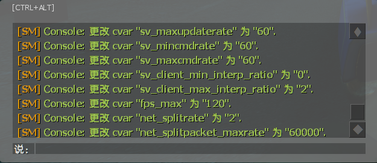

# 屏蔽游戏自带的部分提示

**原作者: 豆瓣酱な**

> 添加屏蔽SM提示

> 修改源码myinfo
---
Command | 指令
<br>None

Video | 影片展示
<br>None

<details><summary>Image | 图示</summary>

**[SM]** 提示改成只给管理员显示的效果


</details>

<details><summary>ConVar | 控制台变量</summary>

```sourcepawn
// ConVars for plugin "l4d2_PZDmgMsg.smx"

// 屏蔽游戏自带的其它提示 0=显示, 1=屏蔽
// Default: "1"
l4d2_PZDmg_msg "1"

// 屏蔽游戏自带的使用电击器提示 0=显示, 1=屏蔽
// Default: "1"
l4d2_defibrillator_used "1"

// 屏蔽游戏自带的玩家死亡提示 0=显示, 1=屏蔽
// Default: "1"
l4d2_player_death "1"

// 屏蔽游戏自带的玩家离开提示 0=显示, 1=屏蔽
// Default: "1"
l4d2_player_disconnect "1"

// 屏蔽游戏自带的玩家倒下提示 0=显示, 1=屏蔽
// Default: "1"
l4d2_player_incapacitated "1"

// 屏蔽游戏自带的ConVar更改提示 0=显示, 1=屏蔽
// Default: "1"
l4d2_server_cvar "1"

// 屏蔽游戏自带的闲置提示 0=显示, 1=屏蔽
// Default: "1"
l4d2_text_msg "1"

// 屏蔽sourcemod平台自带的SM提示 1=只向管理员显示, 0=对所有人屏蔽
// Default: "1"
l4d2_sourcemod_sm_notify_admin "0"
```
</details>

<details><summary>Translation Support | 支持语言</summary>

```
简体中文
```
</details>

<details><summary>Apply to | 适用于</summary>

```php
L4D2
```
</details>

<details><summary>Require | 需求</summary>

1. [[L4D & L4D2] Left 4 DHooks Direct](https://forums.alliedmods.net/showthread.php?t=321696)
</details>

Related Plugin | 相关插件
<br>None

Changelog | 版本日志
<br>None