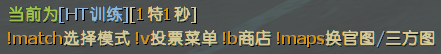

# 📌服务器出安全区提示,配合match更改游戏模式使用

**原作 [Github](https://github.com/txuk1x/g10/blob/main/%E5%BF%85%E9%80%89-%E6%9C%8D%E5%8A%A1%E5%99%A8%E5%8A%9F%E8%83%BD%EF%BC%88kita%EF%BC%89/left4dead2/addons/sourcemod/scripting/serverfunction/text.sp)**

> 基于源码提取而出的插件

> 适配了fdxx/树树子/哈利波特刷特插件
---
<details><summary>Command | 指令</summary>

|指令|效果|权限|
|-|-|-|
|`!cm`|显示当前模式|Console|
</details>

Video | 影片展示
<br>None

<details><summary>Image | 图示</summary>


</details>

ConVar | 控制台变量
<br>None

<details><summary>Translation Support | 支持语言</summary>

```
简体中文
```
</details>

<details><summary>Apply to | 适用于</summary>

```php
L4D2
```
</details>

Require | 需求
<br>None

<details><summary>Related Plugin | 相关插件</summary>

1. [l4d2_server_name](https://github.com/GJKen/L4d2_plugins/tree/main/%E5%8F%AF%E9%80%89-%E6%9C%8D%E5%8A%A1%E5%99%A8%E5%90%8D%E7%A7%B0%2C%E5%8F%AF%E6%98%BE%E7%A4%BA%E7%89%B9%E6%84%9F%E6%95%B0%E9%87%8F%E5%92%8C%E6%97%B6%E9%97%B4%2C%E8%B7%AF%E7%A8%8B%2C%E7%BC%BA%E4%BA%BA%2C%E6%A8%A1%E5%BC%8F(1.0.1.0)(%E5%A4%9C%E9%9B%A8%E7%9C%9F%E7%99%BD))
</details>

Changelog | 版本日志
<br>None