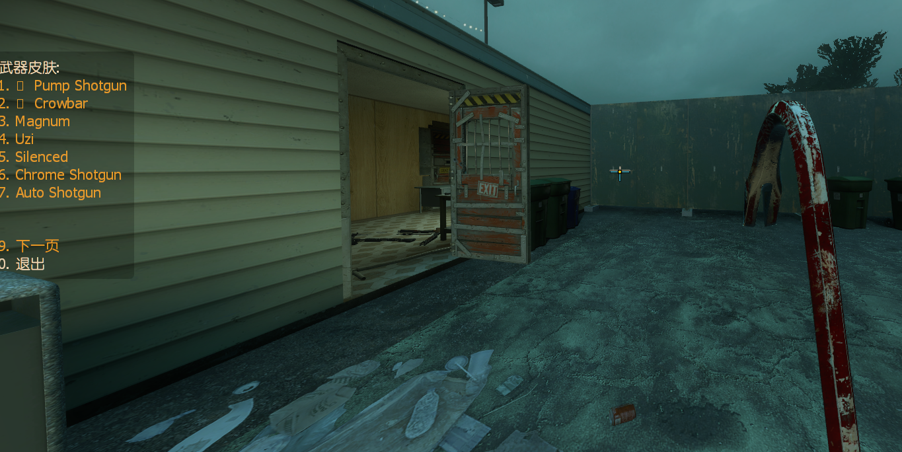

# 📌武器皮肤

<details><summary>分别简述这三个插件的作用</summary>

<details><summary>l4d2_wskin_menu.smx</summary>

**原作 [alliedmods](https://forums.alliedmods.net/showthread.php?t=327611)**
	
> 修改translations文件名称为 l4d2_wskin_menu.phrases.txt

> 修改提示文案

> 修改插件名称为 l4d2_wskin_menu.smx

<details><summary>Command | 指令</summary>

|指令|功能|权限|
|-|-|-|
|`!wskin`|打开武器皮肤菜单|Console|
</details>

<details><summary>图示</summary>

menu菜单展示
<br>


<br>

官方武器皮肤


测试三方武器皮肤

</details>

---

</details>

<details><summary>l4d2_wskin_switch.smx</summary>

原作 [alliedmods](https://forums.alliedmods.net/showthread.php?t=328478)

- 当地上的武器和手里的武器皮肤不一致时, 按E可切换

---

</details>

<details><summary>l4d2_wskin_rng.smx</summary>

原作 [alliedmods](https://forums.alliedmods.net/showthread.php?t=327609)

- 给官方武器随机皮肤, 同时可以给部分支持 RNG 的 Mod 切换皮肤
- 随机皮只能从掉落或者刷新在地上的武器获得
- 插件刷出的武器也可以随机皮

<details><summary>Command | 指令</summary>

|指令|功能|权限|
|-|-|-|
|`!wskin_rng`|实时随机打乱武器皮肤(需要管理员z标志)|Admin|
|`!print_cvars_l4d2_wskin_rng`|将插件相关的 cvars 及其各自的值打印到控制台(需要管理员z标志)|Admin|
</details>
</details>

---

</details>

<details><summary>❗注意事项</summary>

皮肤的改变是通过改变武器 "m_nSkin" netprop 值来实现的

对于生成器实体,"m_nWeaponSkin"也更改为相同的值

如果默认情况下地图更改了武器的外观, 则此插件不会阻止它

当武器已经装备(激活)时, 我必须将皮肤也应用到"m_hViewModel"netprop, 否则皮肤更改会有一些延迟

并非所有武器都有新皮肤, 有些武器与原来的皮肤没有太大区别

目前支持的武器有:

- 近战:撬棍, 板球棒
- 手枪:马格南
- 冲锋枪:Uzi, Smg
- 霰弹枪:木喷, 铁喷, 连喷
- 煤气罐

这些武器有 2 款新皮肤:马格南; M16; AK47, 其他就1把

11 种武器共有 14 种新皮肤

煤气罐皮肤不受此插件的影响

截至 2020 年 9 月 29 日, 已没有更多皮肤可用

对于使用插件更改武器外观的客户端, 该插件可能无法正常工作

启用煤气罐 RNG 皮肤可能会导致一些插件出现故障, 这些插件会检查皮肤以检测是否是清理皮肤

不知道和金撬棍(Golden Crowbar)成就有没有冲突
</details>

---
<details><summary>Video | 影片展示</summary>

[Youtube](https://youtu.be/w_CrGjsEg7I)

> 视频来自: Lucarbuncle
</details>

<details><summary>Translation Support | 支持语言</summary>

```
en
es
hu
pt
pt_pru
ua
chi
zho
```
<details><summary>Apply to | 适用于</summary>

```php
L4D2 Only
```
</details>