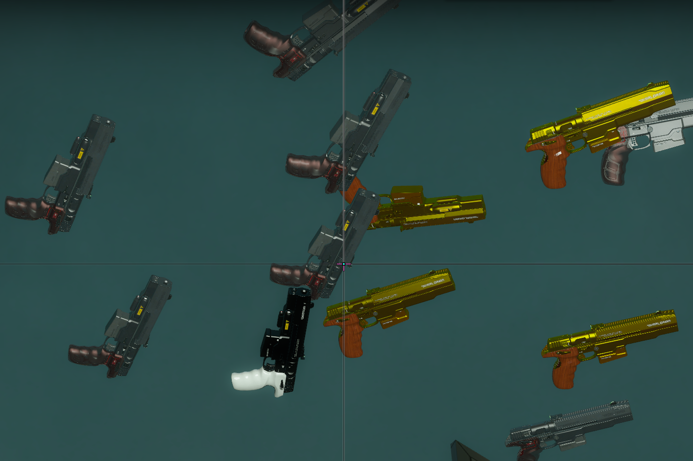

# 📌武器随机皮肤

原作 [alliedmods](https://forums.alliedmods.net/showthread.php?t=327609)

支持官方随机皮肤, 同时可以给部分支持RNG 的 Mod 随机皮肤

<details><summary>简介</summary>

将随机皮肤应用于生成时的武器实体

允许为武器装备与刷怪实体相同的皮肤 (例如:Weapon_rifle_spawn)

允许配置哪些武器应具有 RNG 皮肤

忽略已经具有与默认皮肤不同的武器
</details>

<details><summary>注意事项</summary>

皮肤的改变是通过改变武器 "m_nSkin" netprop 值来实现的

对于生成器实体,"m_nWeaponSkin"也更改为相同的值

如果默认情况下地图更改了武器的外观, 则此插件不会阻止它

当武器已经装备(激活)时, 我必须将皮肤也应用到"m_hViewModel"netprop, 否则皮肤更改会有一些延迟

并非所有武器都有新皮肤, 有些武器与原来的皮肤没有太大区别

目前支持的武器有:

- 近战:撬棍, 板球棒
- 手枪: Magnum
- 冲锋枪:Uzi; Silenced
- 霰弹枪:Pump; Chrome; Auto
- Gascan

这些武器有 2 款新皮肤:Magnum； M16； AK47, 其他就1把

11 种武器共有 14 种新皮肤

煤气罐皮肤不受此插件的影响

截至 2020 年 9 月 29 日, 已没有更多皮肤可用

对于使用插件更改武器外观的客户端, 该插件可能无法正常工作

启用 Gascan RNG 皮肤可能会导致一些插件出现故障, 这些插件会检查皮肤以检测是否是清理皮肤

不知道和"金撬棍"成就有没有冲突
</details>

---
<details><summary>Video | 影片展示</summary>

[Youtube](https://youtu.be/w_CrGjsEg7I)

> 视频来自(Credits: Lucarbuncle)
</details>

<details><summary>Image | 图示</summary>

官方武器皮肤


三方武器皮肤

</details>

<details><summary>Command | 指令</summary>

|指令|功能|权限|
|-|-|-|
|`!wskin_rng`|实时随机打乱武器皮肤(需要管理员z标志)|Admin|
|`!print_cvars_l4d2_wskin_rng`|将插件相关的 cvars 及其各自的值打印到控制台(需要管理员z标志)|Admin|
</details>

<details><summary>ConVar | 控制台变量</summary>

cfg\sourcemod\l4d2_wskin_rng.cfg
```sourcepawn
// This file was auto-generated by SourceMod (v1.11.0.6936)
// ConVars for plugin "l4d2_wskin_rng.smx"

// 插件的版本
l4d2_wskin_rng_version "1.1.0"

// 启用/禁用插件, 0=关, 1=开
l4d2_wskin_rng_enable "1"

// 忽略皮肤与默认皮肤不同的武器, 0=关, 1=开
l4d2_wskin_rng_ignore_skin "1"

// 马格南的武器皮肤 RNG, 0=关, 1=开
l4d2_wskin_rng_pistol_magnum "1"

// 泵霰弹枪的武器皮肤 RNG, 0=关, 1=开
l4d2_wskin_rng_pump_shotgun "1"

// 自动霰弹枪的武器皮肤 RNG, 0=关, 1=开
l4d2_wskin_rng_shotgun_chrome "1"

// 自动霰弹枪的武器皮肤, 0=关, 1=开
l4d2_wskin_rng_auto_shotgun "1"

// SMG Uzi 的武器皮肤, 0=关, 1=开
l4d2_wskin_rng_smg_uzi "1"

// 消音 SMG 的武器皮肤 RNG, 0=关, 1=开
l4d2_wskin_rng_smg_silenced "1"

// M16 步枪的武器皮肤 RNG, 0=关, 1=开
l4d2_wskin_rng_rifle_m16 "1"

// AK47 步枪的武器皮肤 RNG, 0=关, 1=开
l4d2_wskin_rng_rifle_ak47 "1"

// 狩猎步枪的武器皮肤 RNG, 0=关, 1=开
l4d2_wskin_rng_hunting_rifle "1"

// 用于棒球棒的武器皮肤 RNG, 0=关, 1=开
l4d2_wskin_rng_cricket_bat "1"

// 用于撬棍的武器皮肤, 0=关, 1=开
l4d2_wskin_rng_crowbar "1"

// Gascan 的武器皮肤 RNG, 注意:启用此功能可能会导致某些检查 Gascan 皮肤以检测是否为清除皮肤的插件出现故障, 0=关, 1=开
l4d2_wskin_rng_gascan "0"
```
</details>

Translation Support | 支持语言
<br>None

<details><summary>Apply to | 适用于</summary>

```php
L4D2 Only
```
</details>

Require | 需求
<br>None

<details><summary>Related Plugin | 相关插件</summary>

1. [[L4D2] Weapons Skins Menu](https://forums.alliedmods.net/showthread.php?t=327611) by [Marttt](https://forums.alliedmods.net/member.php?u=290327)
2. [[L4D2] Weapons Skins Switch](https://forums.alliedmods.net/showthread.php?t=328478) by [Marttt](https://forums.alliedmods.net/member.php?u=290327)
3. [[L4D2] Weapon Skin Manager](https://forums.alliedmods.net/showthread.php?t=327920) by [Qtheman](https://forums.alliedmods.net/member.php?u=92505)
</details>

<details><summary>Changelog | 版本日志</summary>

- 1.1.0 (17-September-2022)
	- Added cvar to ignore weapons that already have a skin different than default. (thanks "HarryPotter" for requesting)

- 1.0.9 (14-March-2022)
	- Added safe check while getting the entity skin to prevent errors. (thanks "HarryPotter" for reporting)

- 1.0.8 (12-March-2022)
	- Fixed gascans not applying skin on pickup. (thanks to "Toranks" for reporting and "ryzewash" for the code snippet to fix it)

- 1.0.7 (17-October-2021)
	- Fixed prop_physics gascans not changing their skin when enabled. (thanks to "ryzewash" for reporting)

- 1.0.6 (04-June-2021)
	- Added gascan option. (thanks to "TrevorSoldier" for requesting)

- 1.0.5 (10-November-2020)
	- Fixed logic to apply RNG skin only after the config is loaded.
	- Fixed error when the StringMaps weren't initialized yet. (thanks to "Krufftys Killers" for reporting)

- 1.0.4 (10-November-2020)
	- Added cvar to select which weapons should have RNG skin. (thanks to "larrybrains" for requesting)

- 1.0.3 (03-November-2020)
	- Fixed spawner entities' skin logic.
	- Removed RNG logic from owned weapons.
	- Added admin command to scramble weapon skins in real-time.
	- Fixed compatibility with the skin menu plugin.

- 1.0.2 (30-September-2020)
	- Fixed a bug where sometimes it didn't apply the correct skin when picking up an item from a spawner with count = 1. (thanks "Tonblader" for reporting)

- 1.0.1 (30-September-2020)
	- Removed EventHookMode_PostNoCopy from hook events. (thanks "AK978" for reporting)

- 1.0.0 (29-September-2020)
	- Initial release.
</details>