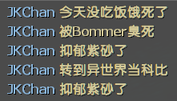

# 📌玩家输入 `!zs` 指令自杀

**原作 [Github](https://github.com/txuk1x/g10/blob/main/%E5%BF%85%E9%80%89-%E6%9C%8D%E5%8A%A1%E5%99%A8%E5%8A%9F%E8%83%BD%EF%BC%88kita%EF%BC%89/left4dead2/addons/sourcemod/scripting/serverfunction/zisha.sp)**

> 修改源码自杀提示文案为随机的文案提示

> 修改源码myinfo
---
<details><summary>Command | 指令</summary>

|指令|功能|权限|
|-|-|-|
|`!zs` \ `!kill`|快速清空血条, 转生异世界|Console|
</details>

Video | 影片展示
<br>None

<details><summary>Image | 图示</summary>


</details>

<details><summary>ConVar | 控制台变量</summary>

cfg/sourcemod/l4d2_player_suicide.cfg
```sourcepawn
// 启用玩家自杀指令. 0=禁用, 1=只限倒地或挂边的生还者, 2=无条件使用
// Default: "1"
l4d2_player_suicide "2"

// 设置开局提示自杀指令的延迟显示时间/秒. 0=禁用
// Default: "7"
l4d2_suicide_start_tips "0"
```
</details>

<details><summary>Translation Support | 支持语言</summary>

```
简体中文
```
</details>

<details><summary>Apply to | 适用于</summary>

```php
L4D2
```
</details>

Require | 需求
<br>None

Related Plugin | 相关插件
<br>None

<details><summary>Changelog | 版本日志</summary>

- (1.0.3 2024/1/26 UTC+8) 修改随机自杀文案提示

- (1.0.2 2024/1/26 UTC+8) 修改部分默认cvar值, 源码myinfo, 自杀文案

</details>